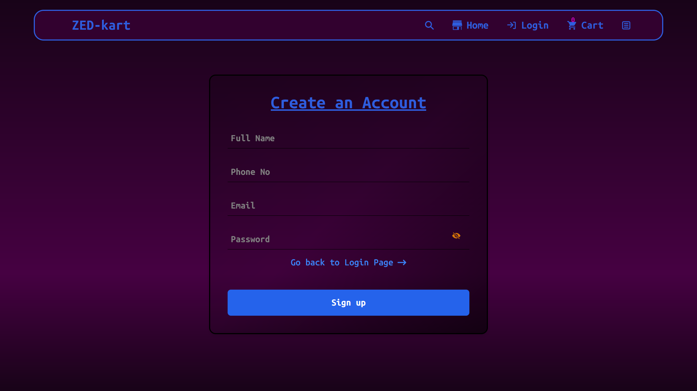
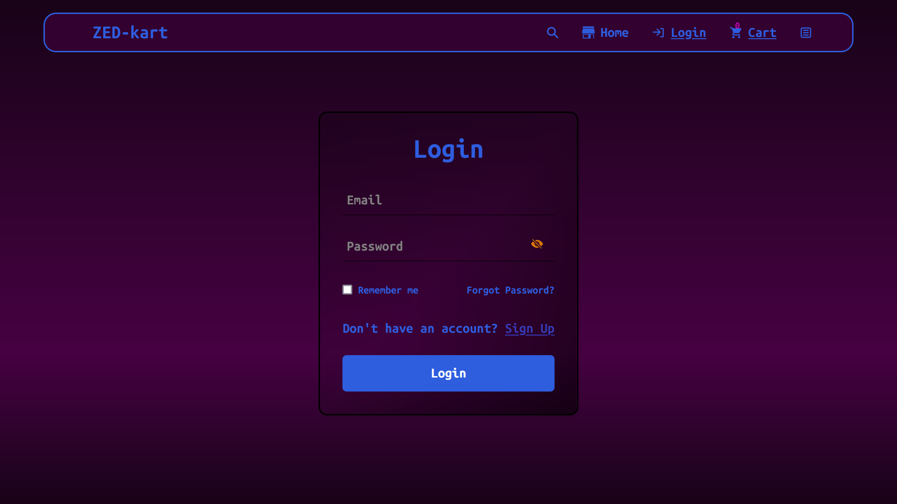
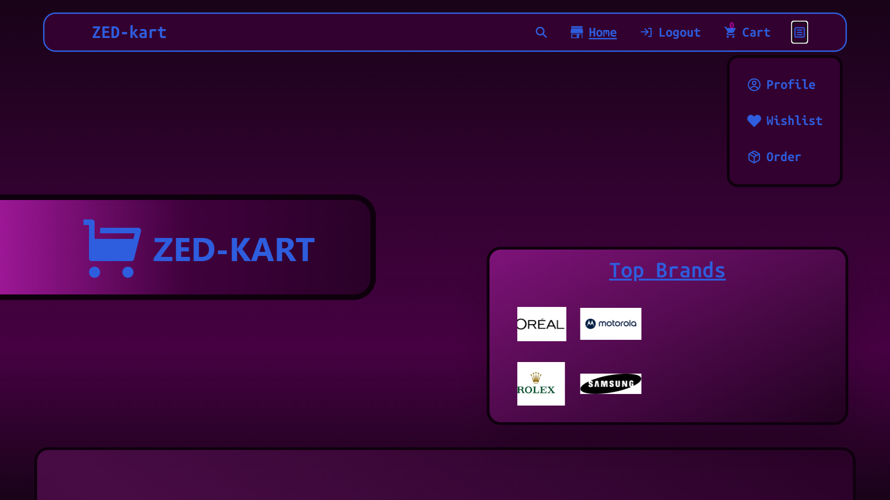
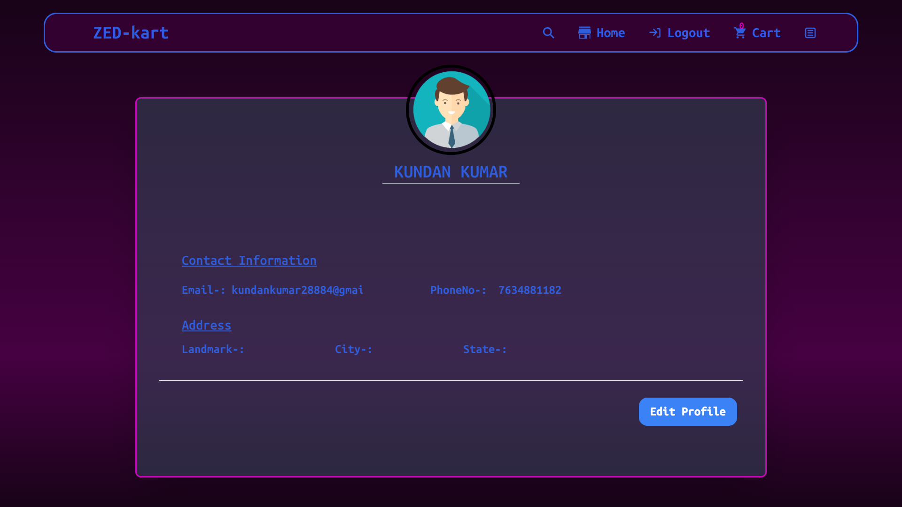

# Zed-kart: E-commerce Website with Animations

Zed-kart is an innovative e-commerce website featuring dynamic animations and a smooth user experience. This project leverages modern web technologies to create an engaging shopping platform.

## Installation

To get started with Zed-kart, follow these steps:

1. **Clone the repository**:

   ```sh
   git clone https://github.com/07kundan/E-Commerce.git
   cd Commerce
   ```

2. **Install dependencies**:

   ```sh
   npm install
   ```

3. **Run the development server**:

   ```sh
   npm start dev
   ```

4. **Open your browser**:
   Navigate to `http://localhost:5173` to see the application in action.

## Deployment

The project is automatically deployed to Netlify whenever changes are pushed to the `main` branch. You can access the live website at `https://zed-kart.netlify.app/`.

## Screenshots

**Signup Page :**
First you have to signup to explore everything on website.


**Login Page :**
After signup it'll redirect you to login page.


**Menu List:**
After login you can view menulist by clicking on hamburger button.


**Profile Page :**
And by clicking profile button you can see your profile details.


## Also you can check other features/section after you loggedIn.

## Technologies Used:

- **Frontend:**
  - React: A powerful JavaScript library for building user interfaces.
  - Framer Motion: Enables creation of smooth, performant animations for an enhanced user experience.
  - Swiper: A popular library for creating touch-enabled sliders and carousels, perfect for product showcases.
  - Appwrite: A secure, open-source backend-as-a-service (BaaS) platform for managing user data, authentication, and other backend needs.
  - React Router DOM: Facilitates navigation between different sections of the website, ensuring a smooth user flow.
  - React Icons: Provides a comprehensive set of SVG icons for various use cases, enhancing the visual appeal of the website.

**Features:**

- **Dynamic Animations**: Utilizes Framer Motion for smooth and interactive animations.
- **Responsive Carousel**: Implemented using Swiper for a responsive and touch-friendly product slider.
- **User Authentication**: Powered by Appwrite to manage user sessions and authentication.
- **Routing**: Seamless navigation with React Router DOM.
- **Iconography**: Enhanced UI using React Icons for visually appealing elements.
  **Development Status:**

Zed-kart is actively under development, with new features and functionalities being added regularly.

**Future Plans:**

- Integration of additional payment gateways to cater to wider audience preferences.
- Implementation of advanced search and filter options for a refined product browsing experience.
- Exploration of features like product reviews and ratings to foster user engagement.
- Continuous optimization for performance and responsiveness across different devices.
